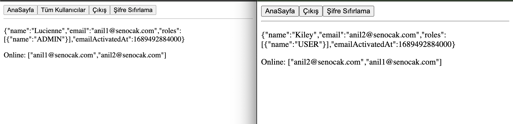

# Spring Boot(Kotlin) & React(TypeScript) Boilerplate

## Technologies - Backend
- Jvm: 17 
- Kotlin: 1.9.22
- Spring Boot: v3.2.2
  - Spring Docker Compose
  - Spring Data JPA
  - Spring Data Redis
  - Spring Actuator
  - Spring Mail
  - Spring Websocket
  - Spring Validation
  - Spring Security + JWT Token
  - Flyway
  - PostgreSQL
  - Swagger (Open API)

## Technologies - Frontend
- Node: 14
- TypeScript: 4.9
- React: 18
    - react-dom
    - react-i18next
    - react-redux
    - react-router-dom
    - react-scripts
    - redux-logger

## Customization

- You can customize ```token information (secret key, issuer, expiry date) ``` in [*application.yml*](https://github.com/senocak/SpringBoot-Kotlin-React-TypeScript-Boilerplate/blob/main/spring-kotlin17/auth/src/main/resources/application.yml#L63) file.
- You can customize ```database connection information``` in [*application.yml*](https://github.com/senocak/SpringBoot-Kotlin-React-TypeScript-Boilerplate/blob/main/spring-kotlin17/auth/src/main/resources/application.yml#L9) file.
- You can customize ```redis connection information``` in [*application.yml*](https://github.com/senocak/SpringBoot-Kotlin-React-TypeScript-Boilerplate/blob/main/spring-kotlin17/auth/src/main/resources/application.yml#L82) file.
- You can customize ```mail connection information``` in [*application.yml*](https://github.com/senocak/SpringBoot-Kotlin-React-TypeScript-Boilerplate/blob/main/spring-kotlin17/auth/src/main/resources/application.yml#L68) file.

## Run the Application

Navigate to the root of the project. For building the project using command line, run below command :
```sh
cd spring-kotlin17/auth/
./gradlew clean
./gradlew build
java -jar build/libs/auth-0.0.1.jar
```
or if you use docker;
```sh
docker compose up -d
```

## Postman Collection

- [You can access the Postman collection here](https://github.com/senocak/SpringBoot-Kotlin-React-TypeScript-Boilerplate/blob/main/spring-kotlin17/auth/src/main/resources/static/kotlin%20spring%20boilerplate.postman_collection.json)

### SS



### License

Apache License 2.0